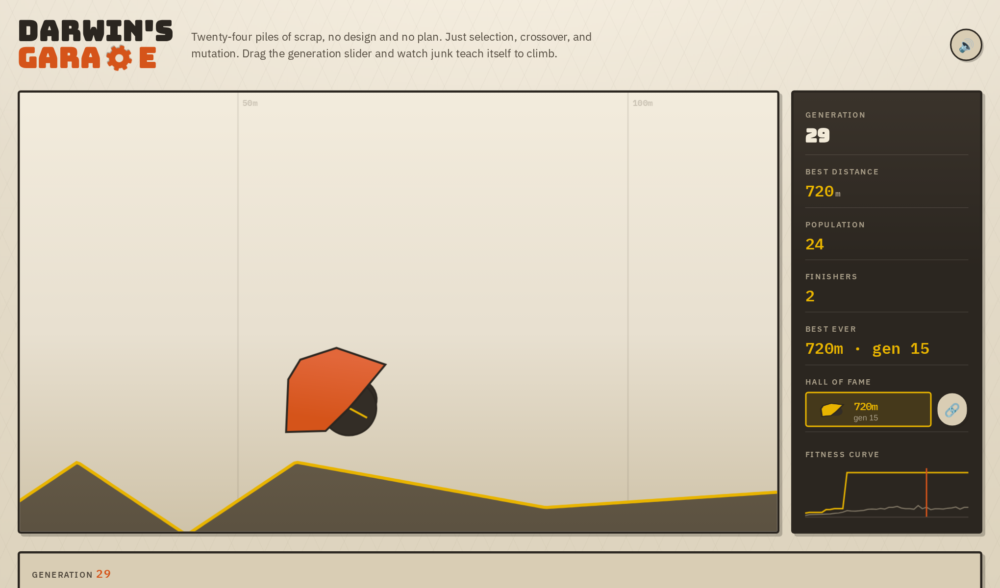

# Darwin's Garage

**▶ Live demo — [apps.charliekrug.com/darwins-garage](https://apps.charliekrug.com/darwins-garage/)**

[](https://github.com/ctkrug/darwins-garage/actions/workflows/ci.yml)
[](LICENSE)

Evolve a car out of scrap, in your browser. Twenty-four vehicles built from random numbers drive
a hill course under real 2D physics, the ones that get furthest breed, and forty generations later
something that nobody designed is climbing the whole thing.



## Who it is for

People who lost an afternoon to BoxCar2D and want that back without Flash, and anyone who wants to
watch a genetic algorithm actually converge instead of reading about one. If you have ever wanted
to see selection pressure do something visible, this is 40 generations of it on a slider.

## What it does

Every car starts as a random skeleton: a polygon chassis of five to eight vertices, wheels bolted
to random corners at random radii, each with its own torque. Generation 0 is a pile of junk that
flops, flips, and goes nowhere on the rubble field.

From there a real genetic algorithm takes over. Tournament selection picks parents, crossover
splices two parent chassis into a child, and mutation nudges wheel position, radius, torque, and
chassis geometry. Each candidate runs the same course inside a Matter.js simulation, and the
distance it covers before it flips, stalls, or runs out of time is its fitness. On the shipped
course the best car covers 58m in generation 0 and the full 720m by generation 20.

## Why it was worth building

Physics-based car evolution is not a new idea. The hard part is the tuning: a fitness function,
mutation rate, and selection pressure that make evolution visibly converge rather than stalling on
generation 3 or exploding into physics garbage by generation 10. The genetic algorithm and the
physics engine are both well-understood parts. Making them cooperate so that progress is legible
on a slider is the actual work, and it is why the track is shaped the way it is: a flat run-up, a
rubble field that filters out the shapes that only topple forward, then a climb.

## Features

- **Evolution engine** with tournament selection, crossover, and mutation over a chassis and wheel
  genome, tuned so the fitness curve climbs steadily instead of solving the course by generation 4.
- **Generation scrubber.** The page evolves all 40 generations on load and opens the slider as each
  one lands. Scrub to any generation to replay its best car, or tap any car on the floor to watch
  that one instead.
- **Hall of fame.** The best run so far is pinned to the HUD with its own share button and updates
  the moment a new best-ever fitness appears.
- **Shareable replay links.** Any car packs into a URL carrying its full genome, checksummed so a
  link that got cut short in a chat window is refused rather than quietly replaying a different
  car. No server, no database row.
- **Live HUD** showing generation, best distance, finishers, best-ever, and a fitness curve that
  plots the best and average of every generation as the run evolves.
- **Playback controls.** Play/pause, 0.5x to 4x speed, and step buttons that scrub one physics tick
  at a time. Speed and stepping only change how a decided run is shown, never the physics.
- **Synthesized sound and a win celebration.** Every effect is built from oscillators at runtime
  with no audio files, the mute toggle persists, and a new best-ever flashes the HUD gold and fires
  confetti.

Not built yet: a track editor for drawing custom terrain, and saving custom courses.

## Run it locally

```bash
git clone https://github.com/ctkrug/darwins-garage.git
cd darwins-garage
npm install
npm run dev
```

Then open the URL it prints. Node 20 or newer.

## Development

```bash
npm run dev      # local dev server
npm test         # node --test: pure logic plus physics, no browser needed
npm run lint
npm run build    # -> site/, static and relative-pathed for subpath hosting
npm run preview  # serve the built site/
```

Runs are seeded, so the demo is reproducible: the same seed always produces the same 40
generations. `test/acceptance.test.js` runs the real demo and guards that promise, which is why it
is slow on purpose.

## How the code is laid out

| Module | Job |
|---|---|
| `src/genome.js` | The car genome: chassis vertices, wheels, and validation. |
| `src/evolution.js` | Selection, crossover, and mutation. |
| `src/simulate.js` | Runs one genome through Matter.js and scores it. |
| `src/history.js` | Runs a whole population across generations. |
| `src/track.js` | The course as plain data. |
| `src/render.js` | Canvas drawing and the camera. |
| `src/share.js` | Packing a car into a URL, and getting it back out. |
| `src/main.js` | The DOM, the render loop, and the wiring between them. |

[`docs/ARCHITECTURE.md`](docs/ARCHITECTURE.md) has the full map and the decisions behind it,
[`docs/DESIGN.md`](docs/DESIGN.md) covers the visual direction, and [`docs/VISION.md`](docs/VISION.md)
and [`docs/BACKLOG.md`](docs/BACKLOG.md) cover the scope.

## Stack

- **JavaScript**, vanilla ES modules. No framework: this is a simulation and a canvas, not a
  component-heavy UI.
- **[Matter.js](https://brm.io/matter-js/)** for 2D rigid-body physics.
- **Canvas 2D** for rendering.
- Static build, zero backend. It deploys to any static host.

## License

MIT, see [LICENSE](LICENSE).

More of Charlie's projects → https://apps.charliekrug.com
